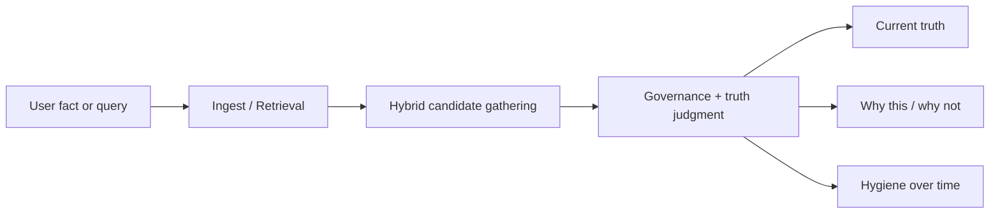

# TruthKeep Memory

**Correctness-first memory for AI agents.**

TruthKeep Memory is a local-first memory engine for agents, MCP hosts, and long-running assistants that need more than "retrieve the closest note."

It is built for a harder problem:

- facts change over time
- old facts must stop leaking back
- the system should explain why one memory won and another lost

Most memory systems stop at search and ranking. TruthKeep adds a governed truth layer on top.

## One-Screen Mental Model



## What TruthKeep Actually Is

TruthKeep is a memory engine that tries to answer:

- what should be remembered
- what is still true right now
- what has been corrected or superseded
- why this result was selected
- why competing memories were suppressed

In practice, that means it is strongest when you care about **memory correctness**, not just memory retrieval.

## What Makes It Different

TruthKeep is unusual in four ways:

- **Truth-aware recall**
  - It distinguishes current truth from superseded truth.
- **Correction-first design**
  - New corrections are meant to replace old facts cleanly.
- **Explainability**
  - It can surface `why this` and `why not`.
- **Governed memory**
  - Retrieval is not the final decision. Policy, truth state, and judgment matter too.

If you only need "some memory for a chatbot," TruthKeep may be heavier than necessary.

If you need a memory system that stays correct across updates, corrections, and long-running use, this is what TruthKeep is for.

## When To Use It

TruthKeep is a good fit when:

- stale facts are expensive
- corrected information must stay on top
- you need to inspect why a result was chosen
- you want local-first memory without cloud dependence
- you want long-horizon hygiene instead of an ever-growing pile of notes

TruthKeep is probably not the right first choice when:

- you just need a very thin semantic cache
- ease of use matters more than correctness controls
- you want a hosted memory API with a big ecosystem out of the box

## Core Capabilities

TruthKeep currently supports:

- storing memories by scope and type
- correction-aware recall
- `winner / contender / superseded` truth handling
- `why this / why not` result explanations
- governed recall instead of retrieval-only ranking
- long-horizon hygiene, decay, consolidation, and archive behavior
- local SQLite storage with MCP/OpenClaw-compatible surfaces
- software-level compressed retrieval tier inspired by TurboQuant-style ideas

## Why Not Embeddings?

TruthKeep does **not** currently depend on a dense embedding model as its default core.

That is a deliberate tradeoff, not an omission by accident.

The reasoning is:

- TruthKeep's moat is **remembering correctly**, not merely **retrieving the nearest semantic neighbor**
- the current pipeline already combines multiple retrieval forces
  - lexical
  - semantic expansion
  - graph expansion
  - compressed candidate prefilter
  - hybrid governance fusion
- local-first and lightweight deployment matter
  - no mandatory model download
  - no cloud dependency
  - no heavy runtime requirement just to get started

In other words:

- many systems optimize for **distribution memory**
  - easy semantic retrieval everywhere
- TruthKeep optimizes first for **correctness memory**
  - current truth
  - correction integrity
  - explainability
  - governance

That said, TruthKeep is **not anti-embedding in principle**.

If dense retrieval is added later, it should be added as:

- another bounded retrieval signal inside the hybrid layer
- never as a replacement for truth governance
- never as the final authority on what counts as current truth

## Quick Start

Install locally:

```bash
pip install -e .
```

Store a memory:

```bash
truthkeep remember "The release owner is Bao."
```

Recall it:

```bash
truthkeep recall "release owner bao"
```

Inspect the whole-system field snapshot:

```bash
truthkeep field-snapshot
```

Run the short proof flow:

```bash
truthkeep prove-it
```

For the full first-run walkthrough, read:

```bash
cat QUICKSTART.md
```

## Fastest Proof

If you want the shortest possible demonstration that TruthKeep is not just "search with branding," run:

```bash
python scripts/prove_it.py
```

That proof flow checks that:

- a corrected fact stays on top
- a suppressed older fact is still visible through `why not`
- the v10 field snapshot is available
- the compressed retrieval tier is present

## Running It

Start the MCP server:

```bash
aegis-mcp
```

Or inspect startup readiness through the standalone CLI:

```bash
truthkeep mcp --json
```

Run the full test suite:

```bash
python -m pytest tests
```

## Best Demos

Use these when you want to see the system, not just read about it:

- **Short proof**

```bash
python scripts/prove_it.py
```

- **Spotlight**
  - compact current-truth view with `why this` and `why not`

```bash
python scripts/demo_core_spotlight.py
```

- **Full showcase**
  - larger explanation surface with truth, evidence, governance, and graph context

```bash
python scripts/demo_core_showcase.py
```

- **Experience brief**
  - product-facing summary of memory state and readiness

```bash
python scripts/demo_experience_brief.py
python scripts/render_experience_brief_html.py
```

- **Consumer shell**
  - onboarding and user-facing first-run shell

```bash
python scripts/demo_consumer_shell.py
python scripts/render_consumer_shell_html.py
```

- **Dashboard shell**
  - unified overview surface

```bash
python scripts/demo_dashboard_shell.py
python scripts/render_dashboard_shell_html.py
```

## Validation And Stress Checks

TruthKeep has deeper validation than a typical small memory repo.

### Truth spotlight benchmark

```bash
python scripts/benchmark_truth_spotlight.py
python scripts/check_truth_spotlight_gate.py
python scripts/render_truth_spotlight_report.py
```

### Full gauntlet

```bash
python scripts/aegis_gauntlet.py
```

### Long-horizon survival

```bash
python scripts/long_horizon_memory_survival.py
```

### Compressed tier validation

```bash
python scripts/benchmark_compressed_candidate_tier.py
python scripts/check_compressed_tier_gate.py
python scripts/render_compressed_tier_report.py
python scripts/check_compressed_tier_completion.py
```

These checks are there to verify that:

- current truth survives after long simulated timelines
- stale superseded rows do not dominate recall
- ingestion remains bounded under pressure
- the compressed tier does not break governed top-1 behavior

## Architecture, In Plain Language

At a high level, TruthKeep has five big layers:

- **ingest**
  - decides whether something should be admitted
- **retrieval**
  - gathers candidate memories through multiple routes
- **governance**
  - judges which candidate is actually allowed to win
- **truth state**
  - keeps track of what is current vs superseded
- **hygiene**
  - keeps memory usable over time instead of letting it rot

You do not need to understand the internal module layout to use TruthKeep.

If you want the design rationale behind the engine, start with:

- [Why Aegis Core Wins](docs/WHY_AEGIS_CORE_WINS.md)
- [Proof Hub](docs/PROOF_HUB.md)

## Project Layout

The repo is organized simply:

- `aegis_py/`
  - runtime, storage, retrieval, governance, MCP, and public CLI
- `scripts/`
  - demos, proofs, benchmarks, gates, gauntlets
- `tests/`
  - regression, validation, and stress checks
- `docs/`
  - public-facing explanation and supporting notes

## Current Positioning

The shortest honest description of TruthKeep is:

> **TruthKeep is a correctness-first memory engine for AI agents.**

It is strongest where memory has to stay **right**, not merely **relevant**.

## License

MIT
