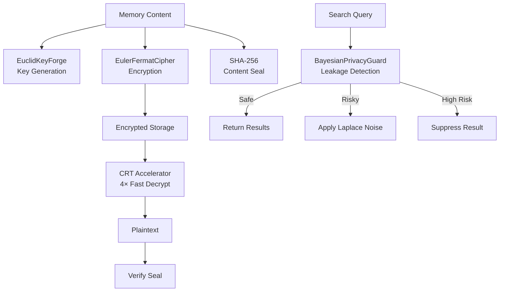

# Security Policy

## Overview

TruthKeep Memory includes a layered encryption and privacy system built entirely in pure Python. The security architecture uses classical mathematical algorithms spanning 2,300 years — from Euclid's algorithm (300 BCE) to Bayesian differential privacy (modern).

All cryptographic implementations live in `aegis_py/security/` and require **zero external dependencies** — no pycryptodome, no cryptography library, no OpenSSL bindings.

## Architecture



## Key Generation

### RSA Key Generation (512-bit, Pure Python)

- **Algorithm**: Extended Euclidean Algorithm (Euclid, 300 BCE)
- **Implementation**: `EuclidKeyForge` in [aegis_py/security/crypto_math.py](aegis_py/security/crypto_math.py)
- **Key size**: 512-bit (optimized for embedded devices)
- **Primality test**: Miller-Rabin with 20 witness rounds (P(false positive) ≤ 10⁻¹²)
- **Public exponent**: e = 65537 (industry standard), with fallback candidates
- **Per-scope keys**: Each `(scope_type, scope_id)` pair gets its own RSA key bundle
- **Lazy generation**: Keys are only generated on first encrypt, then cached
- **Storage**: Keys stored in `crypto_keys` SQLite table as hex strings
- **Management**: `KeyManager` class in [aegis_py/security/key_manager.py](aegis_py/security/key_manager.py)

### Key Lifecycle

1. First encrypt for a scope → `KeyManager.get_or_create_key()` generates new RSA parameters
2. Subsequent operations → key loaded from SQLite + in-memory cache
3. Key rotation → `KeyManager.rotate_key()` deletes old key, generates new one

> ⚠️ **Important**: After key rotation, memories encrypted with the old key must be re-encrypted.

## Encryption / Decryption Flow

### Write Path (Encryption)

1. Content → UTF-8 bytes
2. Split into blocks (each block < n bytes)
3. Each block → integer → `C = M^e mod n` (Euler-Fermat cipher)
4. Concatenate cipher blocks as hex with `:` separator
5. Compute SHA-256 content seal
6. Store: `{encrypted_content, key_id, seal_hash}`

### Read Path (Decryption)

1. Load RSA key by `key_id`
2. Split hex cipher into blocks
3. Each block → `M = C^d mod n` (using CRT fast path if p,q available)
4. Reassemble bytes → decode UTF-8
5. Verify SHA-256 seal against decrypted content

**Implementation**: `MemoryVault` in [aegis_py/security/memory_vault.py](aegis_py/security/memory_vault.py)

## Chinese Remainder Theorem Acceleration

Instead of computing `C^d mod n` directly (very slow for large n):

1. Compute `M₁ = C^(d mod p-1) mod p` — much smaller numbers
2. Compute `M₂ = C^(d mod q-1) mod q` — much smaller numbers
3. Combine using Garner's formula: `M = M₂ + ((M₁ - M₂) × q_inv mod p) × q`

**Result**: ~4× faster decryption because modular exponentiation with half-size numbers is ~4× faster.

**Implementation**: `ChineseRemainderAccelerator` in [aegis_py/security/crypto_math.py](aegis_py/security/crypto_math.py)

## Differential Privacy (Bayesian Guard)

TruthKeep includes defense against **Membership Inference Attacks** — where an attacker asks the AI many indirect questions to determine if a specific piece of data exists in memory.

### How It Works

1. **Query tracking**: Every search query is logged per scope (timestamp + hash)
2. **Probe detection**: Repetitive or high-frequency queries increase `probe_intensity`
3. **Bayesian leakage risk**: `P(leak | response) = P(response|leak) × P(leak) / P(response)`
4. **Defense actions**:
   - Risk < 0.5 → return results normally
   - Risk 0.5–0.8 → apply Laplace noise to relevance scores
   - Risk > 0.8 → suppress the result entirely

### Laplace Noise Mechanism

```
noise ~ Laplace(0, sensitivity/ε)
```

- **ε (epsilon)**: Privacy budget. Lower = more privacy, less accuracy.
  - Apple uses ε = 2–8, Google uses ε = 1–3
  - TruthKeep default: ε = 1.0
- **sensitivity**: Maximum change from adding/removing one record (default: 0.1)

**Implementation**: `DifferentialPrivacyShield` in [aegis_py/security/privacy_guard.py](aegis_py/security/privacy_guard.py)

## SHA-256 Content Sealing

Every memory receives a SHA-256 hash at write time:

```python
seal = hashlib.sha256(content.encode('utf-8')).hexdigest()
```

On read, the seal is verified. If content was tampered with in the database, the seal will not match.

**Functions**: `compute_content_seal()`, `verify_content_seal()` in [aegis_py/security/crypto_math.py](aegis_py/security/crypto_math.py)

## Known Limitations

These are known security limitations. TruthKeep's encryption is designed for **local-first privacy**, not for defending against nation-state adversaries.

| Limitation | Description | Mitigation |
|-----------|-------------|------------|
| **512-bit RSA keys** | Factorable by determined attackers with modern hardware. NIST recommends 2048+ bits for production. | Configurable `bit_size` parameter. Use 2048+ for sensitive deployments. |
| **`random` module** | Uses `random` (Mersenne Twister) instead of `secrets` for prime generation. Not cryptographically secure PRNG. | Swap to `secrets.randbelow()` for production deployments. |
| **FTS5 plaintext indexing** | SQLite FTS5 full-text search indexes store content in plaintext for search capability, even when memory content is encrypted. | Encrypt-then-index with homomorphic search (future work). |
| **No key derivation** | Keys are raw RSA. No KDF (PBKDF2/Argon2) for password-based encryption. | Add KDF layer if user-password encryption is needed. |
## Hardened Mode Scaffold vs Production Security

In version 4.0, TruthKeep introduced the concept of **Security Modes** (defined in `aegis_py/security/config.py`):
- **demo**: Runs on simulator/mock drivers (ideal for rapid local testing).
- **local**: Personal local-first privacy (default, uses fast embedded algorithms).
- **hardened**: Strict production/enterprise target mode.

> [!WARNING]
> **Hardened Mode is currently an Architectural Scaffold/Contract, NOT a full production implementation.**
> 
> While the class and configuration structures are fully set up for Hardened Mode, the underlying security mechanisms still utilize the classical math embedded-grade implementations (e.g., 512-bit RSA, SQLite FTS5 plain text index).
> 
> To transition Hardened Mode to true production-grade security, the following steps are required:
> 1. **Upgrade Cryptography Strength**: Change key generation from 512-bit pure-Python RSA to 2048/4096-bit RSA or X25519/Ed25519 using `cryptography` library / OS-native OpenSSL.
> 2. **Integrate True CSPRNG**: Swap Python's `random` (Mersenne Twister) with `secrets` module or standard OS-native cryptographically secure random number generators (`os.urandom`).
> 3. **Encrypted FTS5 Search**: Replace standard SQLite FTS5 plaintext indexing with homomorphic encryption-compatible search or standard database-level block encryption (e.g. SQLCipher).
> 4. **Hardware Key Storage**: Integrate KeyManager with system native secure storage such as OS Keychain, Windows Credential Manager, or macOS Secure Enclave instead of storing keys directly in SQLite as plaintext hex.

## Vulnerability Reporting

If you discover a security vulnerability in TruthKeep Memory:

1. **Do NOT** open a public GitHub issue
2. Email the maintainers directly (see repository contact information)
3. Include:
   - Description of the vulnerability
   - Steps to reproduce
   - Potential impact assessment
4. We aim to acknowledge reports within 48 hours
5. Security patches will be released as soon as a fix is verified

## Security-Related Files

| File | Purpose |
|------|--------|
| [aegis_py/security/crypto_math.py](aegis_py/security/crypto_math.py) | Core cryptographic algorithms (Euclid, Euler-Fermat, CRT, Bayes) |
| [aegis_py/security/key_manager.py](aegis_py/security/key_manager.py) | Per-scope RSA key management and storage |
| [aegis_py/security/memory_vault.py](aegis_py/security/memory_vault.py) | Transparent memory encryption/decryption layer |
| [aegis_py/security/privacy_guard.py](aegis_py/security/privacy_guard.py) | Differential privacy and probe detection |
