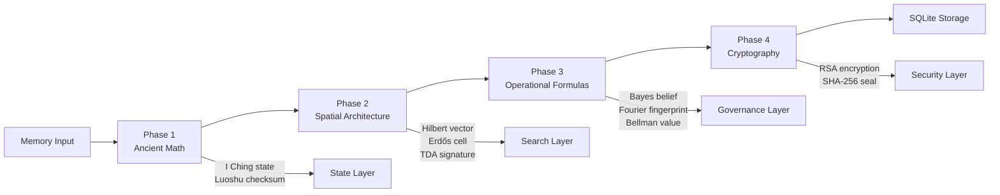

# Mathematical Architecture — 13 Engines Across 4 Phases

## Philosophy

TruthKeep Memory is built on a conviction: **mathematics is the only trustworthy foundation for AI memory**.

Rather than relying on black-box neural models or brute-force retrieval, TruthKeep integrates 13 mathematical engines spanning 3,000 years of human mathematical thought — from the I Ching (c. 1000 BCE) to Backpropagation (1986). Each engine solves a specific memory problem with a proven mathematical formula, implemented in pure Python with zero external dependencies.

The 4 phases form a natural pipeline:

1. **Phase 1 — Ancient Eastern Mathematics**: State encoding and integrity validation
2. **Phase 2 — Spatial Architecture**: Vector space, distance preservation, and topology
3. **Phase 3 — Operational Formulas**: Belief updates, compression, correction propagation, and strategic value
4. **Phase 4 — Classical Cryptography**: Encryption, acceleration, privacy, and integrity seals

---

## Data Flow



---

## Phase 1 — Ancient Eastern Mathematics

> *Trí tuệ cổ đại phương Đông — 3,000 years of mathematical wisdom*

**Implementation**: [aegis_py/storage/ancient_math.py](aegis_py/storage/ancient_math.py)  
**Integration**: [aegis_py/storage/memory.py](aegis_py/storage/memory.py), [aegis_py/storage/manager.py](aegis_py/storage/manager.py)

### Engine 1: I Ching State Encoder (易經, c. 1000 BCE)

**Mathematician/Origin**: King Wen of Zhou, Fu Xi — I Ching (Book of Changes)  
**Class**: `IChingStateEncoder`

**Formula**: 6-bit binary encoding using hexagram structure:

```
state = (trust_bits << 4) | (truth_bits << 2) | kind_bits
```

- Bits 1-2: Memory type (`working=00`, `episodic=01`, `semantic=10`, `procedural=11`)
- Bits 3-4: Truth state (`candidate=00`, `winner=01`, `superseded=10`, `archived=11`)
- Bits 5-6: Trust level (`unverified=00`, `verified=01`, `disputed=10`, `immutable=11`)

**Concrete Example**:
```
Input:  kind="semantic", truth="winner", trust="verified"
Bits:   trust=01, truth=01, kind=10
Result: (01 << 4) | (01 << 2) | 10 = 010110 = 22
Hexagram: Quẻ Dịch số 22 (trạng thái hỗn hợp)
```

Changing lines (Hào Động) detect state transitions via XOR:
```
old=010110, new=010010 → XOR=000100 → Hào 3 changed
```

### Engine 2: Luoshu Integrity Validator (洛書, c. 650 BCE)

**Mathematician/Origin**: Chinese mythology — Luoshu Magic Square  
**Class**: `LuoshuIntegrityValidator`

**Formula**: Cross-embed weights into the Luoshu 3×3 magic square:

```
Luoshu = [[4, 9, 2],       Encrypted = [[w₁×4, w₁×9, w₁×2],
           [3, 5, 7],  →                  [w₂×3, w₂×5, w₂×7],
           [8, 1, 6]]                      [w₃×8, w₃×1, w₃×6]]
```

Integrity check: For each row, recover `w = cell_value / luoshu_value`. If all recovered weights in a row are equal → no tampering. Error score = mean of max-min differences per row.

**Concrete Example**:
```
Input:  [trust=0.9, confidence=0.85, activation=1.0]
Row 0:  [0.9×4, 0.9×9, 0.9×2] = [3.6, 8.1, 1.8]
Row 1:  [0.85×3, 0.85×5, 0.85×7] = [2.55, 4.25, 5.95]
Row 2:  [1.0×8, 1.0×1, 1.0×6] = [8.0, 1.0, 6.0]
Recovery: Each row recovers exact weight → error_score = 0.0 → SECURE ✓
```

### Engine 3: Platonic Quantizer (c. 360 BCE)

**Mathematician/Origin**: Plato — Regular Polyhedra (Icosahedron)  
**Class**: `PlatonicQuantizer`

**Formula**: Project 3D semantic vectors onto the 12 vertices of a regular icosahedron using the golden ratio φ = (1+√5)/2:

```
vertex_idx = argmax_i(normalize(v) · normalize(vertex_i))
```

Vertices are defined using φ: `[±1, ±φ, 0]`, `[0, ±1, ±φ]`, `[±φ, 0, ±1]`

**Concrete Example**:
```
Input:  vector = [1.0, 1.618, 0.0]
Normalized: [0.527, 0.850, 0.0]
Best match: vertex 1 = [1.0, φ, 0.0] normalized → similarity = 0.999
Result: (vertex_idx=1, similarity=0.999)
```

### Engine 4: Fibonacci Decay Engine (1202 CE)

**Mathematician/Origin**: Leonardo Fibonacci — Fibonacci Sequence & Golden Ratio  
**Class**: `FibonacciDecayEngine`

**Formula**: Non-linear decay based on the golden ratio:

```
retained_salience = initial_salience × (1/φ)^(hours/24)
```

Where φ = 1.6180339887 (golden ratio).

**Concrete Example**:
```
Input:  initial_salience = 1.0, interval = 48 hours
Decay:  1.0 × (1/1.618)^(48/24) = 1.0 × 0.618² = 0.382
Result: After 2 days, salience drops to 38.2%
```

---

## Phase 2 — Spatial Architecture

> *Modern mathematical structures for memory vector space*

**Implementation**: [aegis_py/storage/modern_math.py](aegis_py/storage/modern_math.py) (lines 1–515)  
**Integration**: [aegis_py/storage/memory.py](aegis_py/storage/memory.py), [aegis_py/retrieval/compressed_prefilter.py](aegis_py/retrieval/compressed_prefilter.py)

### Engine 5: Hilbert Space Engine — David Hilbert (1900s)

**Class**: `HilbertSpaceEngine`

**Formula**: Cosine similarity in N-dimensional Hilbert space:

```
cos(θ) = (A · B) / (|A| × |B|)
```

Text → vector via character n-gram hashing (2,3,4-grams) into 64 dimensions, then L2-normalized onto the unit sphere.

**Concrete Example**:
```
Input:  text_a = "Paris is the capital of France"
        text_b = "The capital of France is Paris"
Step 1: Extract n-grams: "Pa", "ar", "ri", "Par", "ari", ...
Step 2: Hash each n-gram → position in 64-dim vector
Step 3: L2-normalize both vectors
Result: cosine_similarity ≈ 0.92 (high — same meaning)
```

### Engine 6: Nash Embedding Preserver — John Nash (1956)

**Class**: `NashEmbeddingPreserver`

**Formula**: Distortion ratio measuring information loss during compression:

```
distortion = mean(|d_orig - d_compressed| / max(d_orig, ε))
```

Isometric projection uses Johnson-Lindenstrauss random projection with deterministic seeds.

**Concrete Example**:
```
Input:  original_distances = [1.0, 2.0, 1.5]
        compressed_distances = [0.9, 2.1, 1.4]
Distortion: (|0.1|/1.0 + |0.1|/2.0 + |0.1|/1.5) / 3
          = (0.1 + 0.05 + 0.067) / 3 = 0.072
Result: 0.072 < 0.3 threshold → compression is SAFE ✓
```

### Engine 7: Erdős Index Grid — Paul Erdős (1946)

**Class**: `ErdosIndexGrid`

**Formula**: Discrete geometry grid partitioning for O(N/K²) search:

```
cell = y_cell × grid_resolution + x_cell
neighbors = Moore_neighborhood(cell)  # 9 cells including self
```

Default: 8×8 = 64 cells. Search scans only current cell + 8 neighbors.

**Concrete Example**:
```
Input:  64-dim Hilbert vector for "Paris is the capital"
Step 1: Project to 2D: x_proj = Σv[i]×(±1), y_proj = Σv[i]×(±1)
Step 2: Quantize: x_cell = 5, y_cell = 3
Result: cell_id = 3×8 + 5 = 29
Search: Only scan cells [20,21,22,28,29,30,36,37,38] instead of all 64
```

### Engine 8: Poincaré TDA Engine — Henri Poincaré (1895)

**Class**: `PoincareTDAEngine`

**Formula**: Topological persistence signature (β₀, β₁, β₂):

```
β₀ = connected components (idea clusters)
β₁ = cycles (cross-references, repetition)
β₂ = voids (semantic gaps)

similarity = 1 / (1 + Σ|βᵢ_a - βᵢ_b| × wᵢ)
```

Weights: β₀ × 0.5, β₁ × 0.35, β₂ × 0.15.

**Concrete Example**:
```
Input:  "The cat sat on the mat"
β₀ = 8 (connected character components)
β₁ = 5 (cycles from repeated letters: t, a, etc.)
β₂ = 2 (void approximation)
Signature: (8, 5, 2)
```

### Engine 9: Euler/Cayley Graph Engine — Euler (1736) & Cayley (1878)

**Class**: `EulerCayleyGraphEngine`

**Formulas**:

```
Degree Centrality:      C_D(v) = deg(v) / (N - 1)
Betweenness Centrality: C_B(v) = Σ (σ_st(v) / σ_st)
Combined Score:         S(v) = 0.6 × C_D + 0.4 × C_B
Euler Path:             exists ⟺ 0 or 2 odd-degree vertices
```

**Concrete Example**:
```
Graph: A—B, A—C, B—C, B—D (4 nodes, 4 edges)
Degree:      A=2/3, B=3/3, C=2/3, D=1/3
Betweenness: B has highest (bridge to D)
Hub ranking: B is top hub (0.6×1.0 + 0.4×high = highest combined)
```

---

## Phase 3 — Operational Formulas

> *Dynamic engines that power runtime memory behavior*

**Implementation**: [aegis_py/storage/modern_math.py](aegis_py/storage/modern_math.py) (lines 517–909)  
**Integration**: [aegis_py/v10/v10_dynamics.py](aegis_py/v10/v10_dynamics.py), [aegis_py/retrieval/compressed_prefilter.py](aegis_py/retrieval/compressed_prefilter.py), [aegis_py/hygiene/decay.py](aegis_py/hygiene/decay.py)

### Engine 10: Bayesian Belief Engine — Thomas Bayes (1763)

**Class**: `BayesianBeliefEngine`

**Formula**: Bayes' Theorem for belief update:

```
P(A|B) = P(B|A) × P(A) / P(B)
```

Where:
- P(A) = prior belief (current confidence)
- P(B|A) = likelihood of evidence given hypothesis
- P(B) = marginal probability of evidence

Sequential update: each posterior becomes the next prior.

**Concrete Example**:
```
Input:  prior = 0.7 ("Paris is capital" has 70% confidence)
        likelihood = 0.9 (strong supporting evidence)
        P(B) auto-computed
Step 1: P(B|¬A) = 1 - 0.9 = 0.1
Step 2: P(B) = 0.9×0.7 + 0.1×0.3 = 0.66
Step 3: P(A|B) = (0.9 × 0.7) / 0.66 = 0.955
Result: Confidence rises from 70% → 95.5% after evidence
```

### Engine 11: Fourier Compressor — Joseph Fourier (1822) & Gauss

**Class**: `FourierCompressor`

**Formula**: Discrete Fourier Transform for frequency fingerprinting:

```
X_k = Σ x_n × e^(-i·2π·k·n/N)
Magnitude: |X_k| = √(Re² + Im²)
```

Character frequency distribution → DFT → top-K coefficients → L2-normalize.

**Concrete Example**:
```
Input:  "hello world"
Step 1: Character freq: h=1, e=1, l=3, o=2, w=1, r=1, d=1 (in 256 bins)
Step 2: Normalize to probability distribution
Step 3: DFT → 16 magnitude coefficients
Step 4: L2-normalize → spectral fingerprint
Result: [0.71, 0.12, 0.08, ...] (16 floats)
```

### Engine 12: Backpropagation Engine — Rumelhart & Hinton (1986)

**Class**: `BackpropagationEngine`

**Formula**: Chain rule for error propagation through memory links:

```
gradient = error × link_weight × (1/2^depth) × learning_rate
∂L/∂w₁ = ∂L/∂y × ∂y/∂z × ∂z/∂w₁
```

Max propagation depth: 2 hops. Default learning rate: 0.15.

**Concrete Example**:
```
Scenario: Memory A corrected. Memory B linked to A (weight=0.8, depth=1).
Step 1: gradient = 1.0 × 0.8 × (1/2¹) × 0.15 = 0.06
Step 2: B.confidence_delta = -0.06 (reduced by gradient)
Result: Memory B's confidence drops by 6% due to linked correction
```

### Engine 13: Bellman Value Engine — Richard Bellman (1957)

**Class**: `BellmanValueEngine`

**Formula**: Bellman equation for strategic memory value:

```
V(s) = max[R(s), γ × Σ P(s'|s) × V(s')]
```

Where:
- R(s) = immediate reward (activation × confidence)
- γ = 0.85 (discount factor)
- P(s'|s) = transition probability from link weights

Protects high-value procedural memories from decay retirement.

**Concrete Example**:
```
States: A→B (weight=0.7), A→C (weight=0.3)
Rewards: R(A)=0.6, R(B)=0.9, R(C)=0.3
Iteration 1: V(A) = max(0.6, 0.85 × (0.7×0.9 + 0.3×0.3))
           = max(0.6, 0.85 × 0.72) = max(0.6, 0.612) = 0.612
Result: V(A) = 0.612 → protection factor based on threshold
```

---

## Phase 4 — Classical Cryptography

> *Ancient and classical algorithms securing AI memory*

**Implementation**: [aegis_py/security/crypto_math.py](aegis_py/security/crypto_math.py)  
**Integration**: [aegis_py/security/key_manager.py](aegis_py/security/key_manager.py), [aegis_py/security/memory_vault.py](aegis_py/security/memory_vault.py), [aegis_py/security/privacy_guard.py](aegis_py/security/privacy_guard.py)

### Crypto Engine 1: Extended Euclidean Algorithm (Euclid, 300 BCE)

**Class**: `EuclidKeyForge`

**Formula**: Extended GCD for modular inverse:

```
a×x + b×y = gcd(a, b)
(e × d) ≡ 1 (mod φ(n))  →  d = mod_inverse(e, φ(n))
```

Used to forge RSA decryption keys. Without Euclid, RSA key generation is impossible.

**Concrete Example**:
```
Input:  e=17, φ(n)=120
Step 1: extended_gcd(17, 120)
        17×x + 120×y = 1
        → gcd=1, x=53, y=-7
Step 2: d = 53 mod 120 = 53
Verify: 17 × 53 = 901 = 7×120 + 1 ✓
Result: Decryption key d = 53
```

### Crypto Engine 2: Euler-Fermat Cipher (17th-18th century)

**Class**: `EulerFermatCipher`

**Formula**:

```
Encrypt: C = M^e mod n
Decrypt: M = C^d mod n
```

Euler's theorem guarantees reversibility: M^(e×d) ≡ M (mod n) when (e×d) ≡ 1 (mod φ(n)).

**Concrete Example**:
```
Keys: p=3, q=11, n=33, e=3, d=7
Encrypt: M=7 → C = 7³ mod 33 = 343 mod 33 = 13
Decrypt: C=13 → M = 13⁷ mod 33 = 62748517 mod 33 = 7 ✓
```

### Crypto Engine 3: Chinese Remainder Theorem (Sunzi, 3rd century)

**Class**: `ChineseRemainderAccelerator`

**Formula**: Split large modular exponentiation into smaller parts:

```
M₁ = C^(d mod p-1) mod p    ← small
M₂ = C^(d mod q-1) mod q    ← small
M = M₂ + ((M₁ - M₂) × q_inv mod p) × q  ← Garner combine
```

**Speed**: ~4× faster than direct `C^d mod n`.

**Concrete Example**:
```
Input:  C=13, d=7, p=3, q=11, n=33
Step 1: dp = 7 mod 2 = 1, dq = 7 mod 10 = 7
Step 2: M₁ = 13¹ mod 3 = 1
        M₂ = 13⁷ mod 11 = 7
Step 3: q_inv = mod_inverse(11, 3) = 2
        h = (2 × (1 - 7)) mod 3 = (2 × -6) mod 3 = 0
        M = 7 + 0 × 11 = 7 ✓
```

### Crypto Engine 4: Bayesian Privacy Guard (Bayes, 1763)

**Class**: `BayesianPrivacyGuard`

**Formula**: Differential privacy via Bayesian leakage detection:

```
P(leak | response) = P(response | leak) × P(leak) / P(response)
Laplace noise: noise ~ Lap(0, sensitivity/ε)
```

Defends against Membership Inference Attacks by tracking query patterns and applying noise.

**Concrete Example**:
```
Input:  query_similarity=0.9, prior_exposure=5, confidence=0.8
Step 1: P(leak) = 5 / (5+10) = 0.333
Step 2: P(response|leak) = 0.9 × 0.8 = 0.72
Step 3: P(response|¬leak) = 0.1 + 0.1×0.3 = 0.13
Step 4: P(response) = 0.72×0.333 + 0.13×0.667 = 0.327
Step 5: P(leak|response) = (0.72 × 0.333) / 0.327 = 0.733
Result: Risk 73.3% > threshold 70% → SUPPRESS response
```

---

## SHA-256 Content Sealing

**Function**: `compute_content_seal()` / `verify_content_seal()`

Every memory gets a SHA-256 hash at write time. On read, the hash is verified to detect tampering.

```
seal = SHA-256(content.encode('utf-8'))
verify: SHA-256(stored_content) == stored_seal
```

---

## Performance Notes for Embedded Devices

| Engine | Complexity | Memory | Notes |
|--------|-----------|--------|-------|
| I Ching | O(1) | 64 bytes | Bit manipulation only |
| Luoshu | O(1) | 9 floats | 3×3 matrix operations |
| Platonic | O(1) | 12 vertices | Fixed icosahedron lookup |
| Fibonacci | O(1) | 1 float | Single exponential |
| Hilbert | O(n×d) | 64 floats | n=text length, d=dimensions |
| Nash | O(s×t) | t floats | s=source dim, t=target dim |
| Erdős | O(1) | 1 int | Grid cell assignment |
| Poincaré | O(n) | 3 ints | Character adjacency scan |
| Euler/Cayley | O(V×E) | V+E entries | Bounded by graph size |
| Bayes | O(1) | 1 float | Single division |
| Fourier | O(n×k) | 16 floats | n=256 bins, k=16 coefficients |
| Backprop | O(links) | Per-link | Max depth=2 hops |
| Bellman | O(V×E×i) | V floats | i=20 max iterations |
| RSA keygen | O(bits²) | Key-sized | One-time per scope |
| CRT decrypt | O(log d) | 2 mod-exp | 4× faster than direct |

All engines are **pure Python** — no numpy, scipy, or pycryptodome required. Note that in practical architectures, ESP32 acts as a lightweight client/body invoking TruthKeep via MCP or REST API, while the heavy core logic runs local-first on a PC, Raspberry Pi, or a local server.


---

## Engine Summary Table

| # | Engine | Mathematician | Year | Phase | Purpose |
|---|--------|--------------|------|-------|--------|
| 1 | I Ching Encoder | Fu Xi / King Wen | ~1000 BCE | 1 | Memory state encoding |
| 2 | Luoshu Validator | Chinese mythology | ~650 BCE | 1 | Weight integrity check |
| 3 | Platonic Quantizer | Plato | ~360 BCE | 1 | Semantic vector quantization |
| 4 | Fibonacci Decay | Leonardo Fibonacci | 1202 | 1 | Priority decay over time |
| 5 | Hilbert Space | David Hilbert | 1900s | 2 | Text → vector + similarity |
| 6 | Nash Embedding | John Nash | 1956 | 2 | Distance-preserving compression |
| 7 | Erdős Grid | Paul Erdős | 1946 | 2 | Spatial search optimization |
| 8 | Poincaré TDA | Henri Poincaré | 1895 | 2 | Topological fingerprinting |
| 9 | Euler/Cayley Graph | Euler & Cayley | 1736/1878 | 2 | Knowledge graph centrality |
| 10 | Bayesian Belief | Thomas Bayes | 1763 | 3 | Dynamic confidence update |
| 11 | Fourier Compressor | Joseph Fourier | 1822 | 3 | Frequency fingerprinting |
| 12 | Backpropagation | Rumelhart & Hinton | 1986 | 3 | Correction propagation |
| 13 | Bellman Value | Richard Bellman | 1957 | 3 | Strategic memory value |
| C1 | Euclid Key Forge | Euclid | 300 BCE | 4 | RSA key generation |
| C2 | Euler-Fermat Cipher | Euler & Fermat | 17th-18th c. | 4 | Memory encryption |
| C3 | CRT Accelerator | Sunzi | 3rd century | 4 | 4× decryption speedup |
| C4 | Bayesian Privacy | Thomas Bayes | 1763 | 4 | Differential privacy guard |
