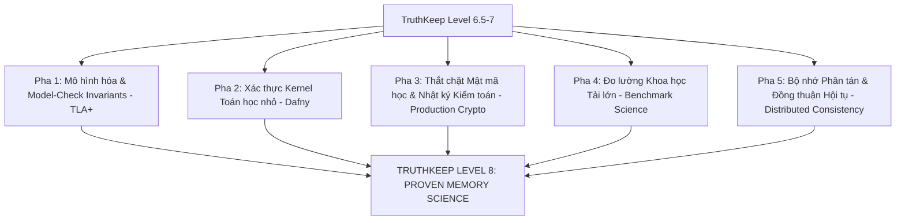

# Lộ trình Nghiên cứu Level 8: Proven-Memory Science Roadmap

> [!NOTE]
> **Định vị Kiến trúc**: Đạt tiêu chuẩn Level 8 không phải là câu chuyện "thêm vài file hay viết thêm vài dòng code là xong". Đây là một **chương trình nghiên cứu dài hạn** phối hợp giữa: Xác thực hình thức (Formal Verification), Hệ thống mật mã học thực tế (Production Crypto), Kiểm toán an ninh (Security Audits), Đo lường khoa học (Benchmark Science) và Nhất quán phân tán (Distributed Consistency).
>
> Tài liệu này phác thảo lộ trình nghiên cứu thực tế, khiêm tốn và có tính khả thi dài hạn cao để đưa **TruthKeep Memory** hướng tới tiêu chuẩn **Level 8 Cognitive Science (Proven Memory Science)**.

---

## 🗺️ Sơ đồ Lộ trình 5 Pha Thực tế hướng tới Level 8

---

## Pha 1: Mô hình hóa & Model-Check Invariants (TLA+)
*Mục tiêu: Đặc tả hình thức và sử dụng TLC Model Checker để chứng minh dynamic state machine không tự mâu thuẫn trong không gian trạng thái hữu hạn.*

### 1.1. Viết Đặc tả TLA+ (`TruthKeepMemory.tla`)
Mô hình hóa chính xác luồng nạp tri thức, đính chính, phân rã và cách ly không gian:
- **Biến trạng thái ký ức (MemoryState)**:
  `draft ──> validated ──> winner ──> superseded ──> archived`
- **Mô hình hóa các Actions**: `Ingest`, `Correct`, `Decay`, `Consolidate`, `Access`.

### 1.2. Xác thực các Bất biến Hệ thống cốt lõi (Core Invariants)
Thiết lập cấu hình `TruthKeepMemory.cfg` để chạy TLC Model Checker kiểm chứng các bất biến sau:
- **UniqueWinnerPerSingletonSlot**: Trong một singleton fact slot (chủ đề duy nhất), tối đa chỉ có $1$ ký ức mang trạng thái `winner` active tại một thời điểm.
- **SupersededNeverCurrentTruth**: Một ký ức đã bị đính chính (`superseded`) không bao giờ được quay trở lại làm `current_truth` hoặc đứng đầu kết quả recall thông thường.
- **ArchivedNeverNormalTop1**: Một ký ức đã hết hạn và lưu trữ (`archived`) không bao giờ được xuất hiện ở vị trí Top-1 trong kết quả truy vấn thông thường của Client.
- **CorrectionKeepsWhyNot**: Một đính chính mới không được phép làm mất đi dấu vết lịch sử giải trình (Why-Not / Truth Transition Timeline) của sự thật cũ.
- **ScopeIsolation**: Dữ liệu thuộc `scope_id` này không bị rò rỉ hoặc truy xuất được từ `scope_id` khác.

> [!IMPORTANT]
> **Phân định rõ phương pháp xác thực hình thức**:
> 1. **TLA+ Spec & TLC Model Checker (CI/Offline)**: TLC kiểm tra đặc tả toán học trừu tượng (`TruthKeepMemory.tla`) bằng cách duyệt cạn toàn bộ không gian trạng thái trong mô hình thu nhỏ hữu hạn (finite model). Quá trình này chứng minh mô hình thiết kế không có deadlock hay lỗi logic thiết kế cơ bản.
> 2. **Runtime Invariant Validator (Python/SQLite)**: Unit test (`tests/test_tla_invariants.py`) đóng vai trò là một bộ kiểm định bất biến runtime. Nó chạy trên mã nguồn Python và cơ sở dữ liệu SQLite thật để đảm bảo rằng quá trình hiện thực hóa (implementation) tuân thủ tuyệt đối 5 bất biến hình thức đã được chứng minh trong TLA+ spec.

---

## Pha 2: Xác thực các Kernel Toán học nhỏ (Dafny)
*Mục tiêu: Đảm bảo các hàm số học cốt lõi không bao giờ gặp lỗi divide-by-zero, out-of-bounds, hoặc chuyển trạng thái bất hợp lệ.*

Thay vì viết lại toàn bộ công thức phức tạp, nghiên cứu tập trung chứng thực các hạt nhân toán học (kernels) nhỏ nhưng tối quan trọng bằng ngôn ngữ **Dafny**:
- **`safe_math.dfy`**: Xác thực hàm `clamp01` luôn giới hạn giá trị trong đoạn $[0.0, 1.0]$, `safe_div` và `bounded_ratio` phòng ngừa lỗi chia cho 0.
- **`truth_transition.dfy`**: Đảm bảo các cổng chuyển đổi trạng thái (`transition_gate`) không tạo ra các trạng thái trung gian bất hợp lệ hoặc mồ côi.
- **`crt_math.dfy`**: Chứng thực thuật toán CRT tái dựng chính xác giá trị số nguyên lớn modulo tích của hai số nguyên tố $p, q$ nếu các giả định đầu vào được thỏa mãn.
- **`winner_selection.dfy`**: Xác thực bất biến chọn lựa winner dựa trên sự so khớp niềm tin Bayes và độ tương đồng TDA.

---

## Pha 3: Thắt chặt Mật mã học & Nhật ký Kiểm toán (Production Crypto)
*Mục tiêu: Chuyển đổi hoàn toàn lớp bảo mật từ giả lập sang thực tế, tích hợp cơ chế kiểm toán đột biến tri thức vững chắc.*

### 3.1. Mã hóa Trường Dữ liệu tĩnh (Encrypted Fields at Rest)
- Tích hợp thư viện `cryptography` chuẩn công nghiệp để triển khai mã hóa đối xứng **AES-GCM-256** hoặc **ChaCha20-Poly1305** cho các trường dữ liệu nhạy cảm (`content`, `summary`) và các tệp tin sao lưu (backups).
- Quản lý khóa Master qua các keystore an toàn của hệ điều hành (**OS Keychain** / Windows Credential Manager / macOS Keychain) kết hợp sinh khóa phiên qua **Argon2id** hoặc **HKDF**.
- **Strict Privacy Mode**: Đảm bảo không lưu vết Plaintext ở bất kỳ chỉ mục SQLite nào khi bật chế độ bảo mật nghiêm ngặt.

### 3.2. Nhật ký Kiểm toán Đột biến liên kết xích (Signed Mutation & Audit Log)
Thay vì sử dụng zk-SNARKs phức tạp và nặng nề ngay từ đầu, chúng ta thực hiện các giải pháp thực tế và vững chãi hơn:
- **Signed Mutation Log**: Mọi thao tác ghi nhớ, đính chính hay xóa tri thức đều được ký số (digital signature) bởi cặp khóa của Agent.
- **Hash Chain Audit Log**: Các bản ghi đột biến được liên kết xích (hash chain) tương tự block header để phát hiện mọi hành vi can thiệp hoặc sửa đổi DB trái phép từ bên ngoài.
- **Merkle Proofs**: Tích hợp cây Merkle (Merkle tree) trên lịch sử ký ức để Client nhanh chóng chứng thực một sự thật cụ thể có nằm trong lịch sử nạp tri thức của Agent hay không thông qua các bằng chứng gọn nhẹ (*Merkle proofs*).

---

## Pha 4: Đo lường Khoa học Tải lớn (Benchmark Science)
*Mục tiêu: Đo đạc và kiểm chứng tính ổn định hiệu năng của dynamic state engine dưới áp lực dữ liệu tăng trưởng phi tuyến tính thực tế.*

Thay vì đặt mục tiêu 1 triệu corrections/giây quá cực đoan ở local run, lộ trình đo lường hiệu năng sẽ đi qua các cột mốc thực tế của phần cứng cá nhân:
- Mốc **100k memories** (Measured): Kiểm chứng độ trễ đọc-ghi thực tế của đơn node.
- Mốc **250k memories** (Measured Stress-test): Chạy so sánh hiệu năng của các feature flags.
- Mốc **500k memories** (Measured): Đánh giá áp lực dọn dẹp của DecayBeast.
- Mốc **1M memories** (Measured / Clearly Extrapolated): Xác định giới hạn vật lý của SQLite DB tĩnh trên local.

**Các chỉ số đo lường khoa học cốt lõi (Metrics)**:
- `correction_top1_rate` (Tỷ lệ đính chính đứng đầu kết quả).
- `superseded_leak_rate` (Tỷ lệ rò rỉ ký ức cũ).
- `why_not_visibility_rate` (Độ rõ ràng của lịch sử giải trình).
- `scope_leak_rate` (Mức độ cách ly giữa các scope).
- Latency percentile (`p50`, `p95`, `p99` read/write latency).
- throughput (rec/sec) & DB footprint size (KB/MB).

---

## Pha 5: Bộ nhớ Phân tán & Đồng thuận Hội tụ (Distributed Consistency)
*Mục tiêu: Đảm bảo tính nhất quán của tri thức tập thể khi nhiều Agent tương tác phân tán.*

Chỉ thực hiện sau khi hệ thống đơn node (single-node) đạt độ chín hoàn hảo về chất lượng và độ ổn định:
- **Replication Envelope**: Đóng gói phong bì đồng bộ ký ức an toàn giữa các Agent cục bộ.
- **Conflict Merge**: Triển khai giải pháp đồng bộ tri thức lấy cảm hứng từ các cấu trúc dữ liệu không xung đột **CRDT (Conflict-Free Replicated Data Types)** cho các sự thật dạng danh sách hoặc thuộc tính.
- **Cognitive Consensus**: Xây dựng thuật toán đồng thuận hội tụ tri thức (lấy cảm hứng từ *Raft* hoặc *PBFT*) giúp mạng lưới Agent tự trị cùng thống nhất về một sự thật lịch sử duy nhất khi nhận các nguồn bằng chứng mâu thuẫn phân tán.

---

## 🔒 3 BƯỚC ĐÁNG LÀM NGAY BÂY GIỜ

1.  **Bước 1: Viết TLA+ Spec cho Core Invariants**
    *   *Nhiệm vụ*: Viết tệp tin đặc tả `TruthKeepMemory.tla` cho luồng ingest/correct/supersede/scope.
    *   *Tiêu chí*: TLC Model Checker pass toàn bộ các invariant chính trong không gian trạng thái hữu hạn.
2.  **Bước 2: Triển khai AES-GCM cho Local/Hardened Mode**
    *   *Nhiệm vụ*: Thay thế lớp mã hóa demo tĩnh bằng thư viện `cryptography` thực tế (AES-GCM hoặc ChaCha20-Poly1305) tích hợp với OS Keychain cho encrypted fields và backups.
    *   *Tiêu chí*: Các bài test roundtrip mã hóa, phát hiện giả mạo (tamper detection) pass hoàn toàn, không còn plaintext rò rỉ ở `encrypted_content`.
3.  **Bước 3: Viết Dafny cho Safe Math Kernels**
    *   *Nhiệm vụ*: Viết đặc tả Dafny cho `clamp01`, `safe_div`, `bounded_ratio`, và `transition_gate`.
    *   *Tiêu chí*: Dafny verifier pass hoàn toàn; đồng thời ánh xạ/đối chiếu thuật toán sang Python code tương ứng kèm bộ test vector nghiêm ngặt.
